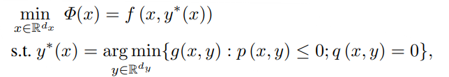

# Hypergrad_for_constrained_bilevel

Compute the hypergradients for constrained bilevel optimization by using the package [Hypergrad](https://github.com/prolearner/hypertorch).
Please first view how to use package Hypergrad. A brief introduction for Hypergrad is attached in the end.

[Hypergrad](https://github.com/prolearner/hypertorch) provides a approach to compute $\nabla f(\lambda)$ for following problem:


 Thanks to [Hypergrad](https://github.com/prolearner/hypertorch), we can form the constrained bilevel optimization problem to this form. Given a constrained bilevel problem.

 

 * First, solve the inner level problem $y^{\star}(x)={\arg\min}_y \{g(x,y): p(x,y)\leq 0; q(x,y)=0\}$, to get the solution $y^{\star}(x)$, $\mu(x)$ and $v(x)$. Here, $(\mu(x), v(x))$ are Lagrange multipliers when $x$ is given and $\mu(x) \geq 0$.
  
 * The Lagrangian is $L(y^{\star}(x), \mu(x), ν(x)) = g(x, y^{\star}(x))+\mu(x)p(x,y^{\star}(x))+v(x)q(x,y^{\star}(x)).$ From the KKT condition achieved at the point  $(y^{\star}(x), \mu(x), v(x))$, we have 
>$\nabla_1 L(y^{\star}(x), \mu(x), ν(x))=0$, 

> $\nabla_3 L(y^{\star}(x), \mu(x), ν(x))=0$ (usually written as $q(x,y^{\star}(x))=0$ in the KKT condition), 

> Moreoever, if $\mu(x)>0$, we have $\nabla_2 L(y^{\star}(x), \mu(x), ν(x))=0$ (usually written as $\mu(x) p(x,y^{\star}(x))=0$ in the KKT condition). 
 
Then, we have $\nabla_x L(y^{\star}(x), \mu(x), ν(x))=0$ if $\mu(x)>0$.
  
 * To fit the form in [Hypergrad](https://github.com/prolearner/hypertorch), we rewrite it as $[y^{\star}(x), \mu(x), ν(x)]^{\top}=[y^{\star}(x), \mu(x), ν(x)]^{\top}-\nabla_x L(y^{\star}(x), \mu(x), ν(x))$. 
  
 * Fit the form to [Hypergrad](https://github.com/prolearner/hypertorch). Here, 
>$x$ corresponds the notation $\lambda$; 

>$[y^{\star}(x), \mu(x), ν(x)]^{\top}$ corresponds the notation of $w(\lambda)$; 

>$[y^{\star}(x), \mu(x), ν(x)]^{\top}-\nabla_x L(y^{\star}(x), \mu(x), ν(x))$ corresponds the map $\Phi(w(\lambda),\lambda)$.
 * If $\mu_i(x)=0$, we can remove $\mu_i(x)$ and $q_i(x,y^{\star}(x))$ from the computation.

The detail of the computation and theorms is shown in our paper [Constrained bilevel optimization](https://arxiv.org/abs/2302.01970).

An example of the code is shown in [example.py](./constrained_bilevel_opt/example.py). 

If you have more questions, fell free to contact me {spx5032@psu.edu}.

If you find our code useful, please consider citing our work. Here is the citation informoation for our paper [Constrained bilevel optimization](https://arxiv.org/abs/2302.01970).
```
@INPROCEEDINGS{ SX-MZ:AAAI23, 
    author = { Xu, Siyuan and Zhu, Minghui },
    title = { Efficient gradient approximation method for constrained bilevel optimization },	 
    booktitle = { AAAI Conference on Artificial Intelligence }, 
    year = { 2023 },    
}
```
 
# Hypergrad
https://github.com/prolearner/hypertorch

Lightweight flexible research-oriented package to compute  hypergradients in [PyTorch](https://github.com/pytorch/pytorch).

## What is an hypergradient?
Given the following bi-level problem.


We call **hypergradient** the following quantity.


Where:
* 
is called the `outer objective` (e.g. the validation loss).
*  is called the `fixed point map` (e.g. a gradient descent step or the state update function in a recurrent model)
* finding the solution of the fixed point equation  is referred to as the `inner problem`. This can be solved by repeatedly applying the fixed point map or using a different inner algorithm.


## Cite

Here is citation informoation for [the paper Hypergrad](https://arxiv.org/abs/2006.16218)
```
@inproceedings{grazzi2020iteration,
  title={On the Iteration Complexity of Hypergradient Computation},
  author={Grazzi, Riccardo and Franceschi, Luca and Pontil, Massimiliano and Salzo, Saverio},
  journal={Thirty-seventh International Conference on Machine Learning (ICML)},
  year={2020}
}
```